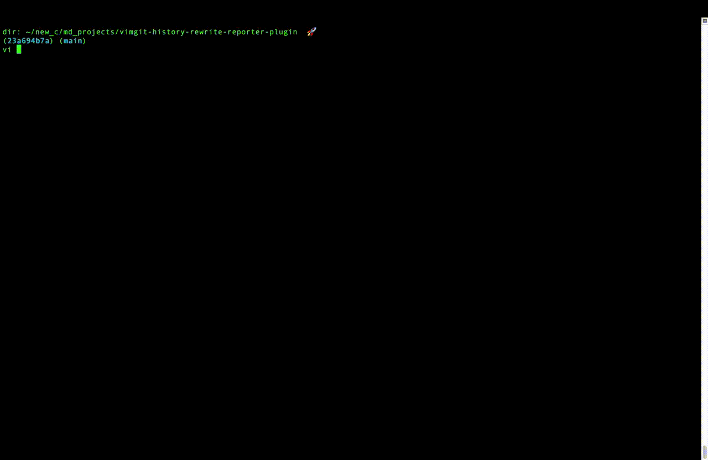

# VimGit (a history rewrite reporter plugin)

## Description
Vim plugin that adds how many times a commit's history has been edited to it's commit description.

## Links
[get file path of current file](https://vi.stackexchange.com/a/1885/48719) - "this is how I found .git/COMMIT_EDITMSG"!
[Example of autocmd using VimEnter that fires the auto vim command](https://www.reddit.com/r/vim/comments/t5ebgq/how_to_run_a_shell_command_when_i_open_or_close_a/)   
[How to move cursor to end of file in command mode.](https://stackoverflow.com/questions/17012308/move-cursor-to-end-of-file-in-vim)  
[Insert the current date or time](https://vimtricks.com/p/insert-the-current-date-or-time/)  
[Quick note about submatch](https://stackoverflow.com/questions/67353566/how-does-the-submatch-command-work-in-vim)  
[Nice document on vim regex](https://dev.to/iggredible/learning-vim-regex-26ep)  
[increment all numbers in a document](https://stackoverflow.com/questions/10420797/vim-regex-increment-all-numbers-by-1)  
[writing functions in vim!](https://learnvim.irian.to/vimscript/vimscript_functions)  

## How to add to your vimrc without a plugin.
1. Download the file to a config folder  
`curl -o ~/.config/vim_history_reporter/vimrc.vim --create-dirs https://raw.githubusercontent.com/MichaelDimmitt/vimgit-history-rewrite-reporter-plugin/main/vimrc.vim`
2. Create a new ~/.vimrc if needed and add this line to your ~/.vimrc  
`source ~/.config/vim_history_reporter/vimrc.vim`

## How to contribute
1. Clone down this project  
2. Point your ~/.vimrc to source the vimrc.vim located in this project instead of the config folder outlined in the install instructions.  
3. make a temp commit by adding a space to the readme.  
4. run git commit --amend a few times.  

## Src
The current code is located at: vimrc.vim
The code with comments added is located at: .vimrc.vim.withcomments.vim

## See it in action

